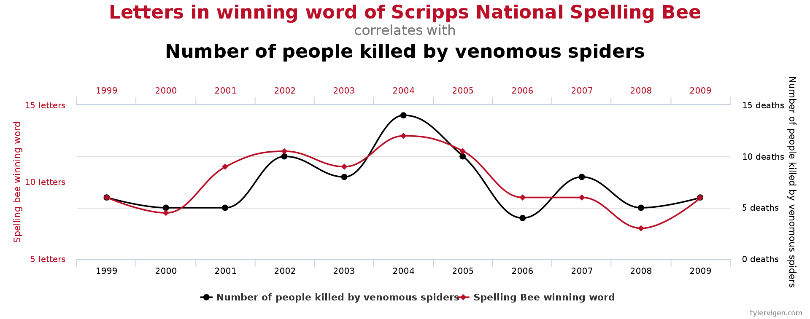
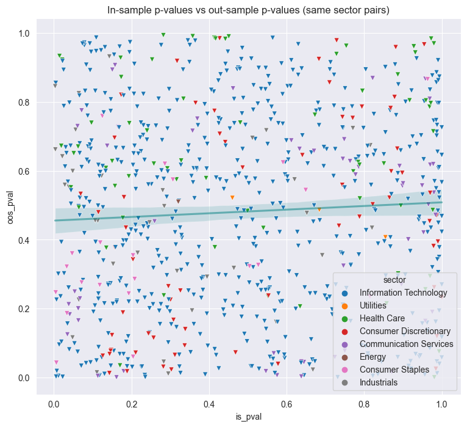

## Pairs Trading NASDAQ Strategy

* Project Structure
    * Backtest and strategy: `pairs_trading_nasdaq.ipynb`
    * Helper files: `pairs_trade_utils.py`
    * Data: `pickles`
* Description
    * A project ([post here](https://ryan-chew.com/quant_pairs_trade.html)), which details implementing & backtesting a weekly pairs trading strategy on NASDAQ equity pairs over several years.
    * The main takeaway was in-sample brute-forcing cointegration tests just results in multiple comparison bias and data dredging: random spurious relationships due to chance.
    * This was seen as the in-sample vs out-sample Engle-Granger p-value scatter plot was very uniform with no obvious correlation. 
 
 

Two completely unrelated time series showing cointegration.

 

In-sample vs out-sample p-values of the Engle-Granger test across various stocks with no linear trend.

